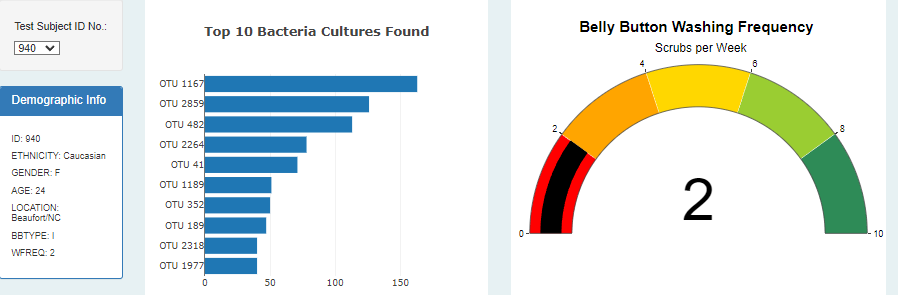
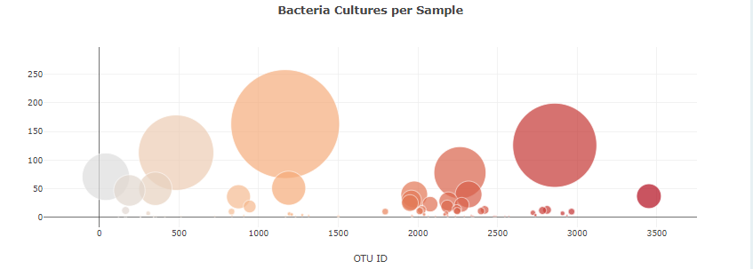

# An analysis and visualization of Belly Button Biodiversity data using Javascript, HTML and Plotly.

## Overview

This project involved a large dataset which was stored in JSON format. The data included information on participants of a study which looked at the bacteria found
in each participants navel. The data included metadata about each participant. The data was accessed via the D3 library in Javascript. HTML code was written to format and populate
the web application. The application was built so that the user can select a study participant number (Test Subject ID No.) from a drop down box and several data visualizations
(bar chart, gauge chart, bubble chart) dynamically update to show the data specific to each participant. An 'init' function was written to auto-populate the charts with the first
participants data (Test Subject ID #940).

### Test Subject Dropdown Box and Charts

### Bubble Chart

